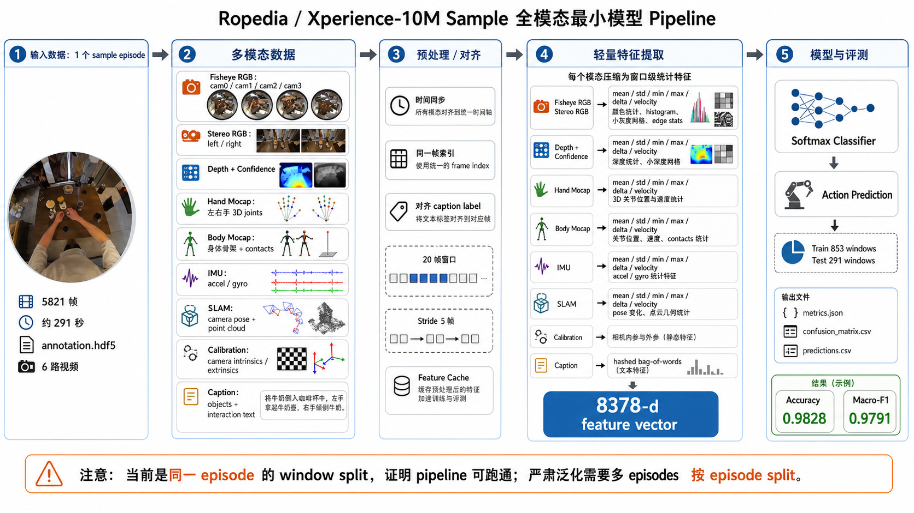
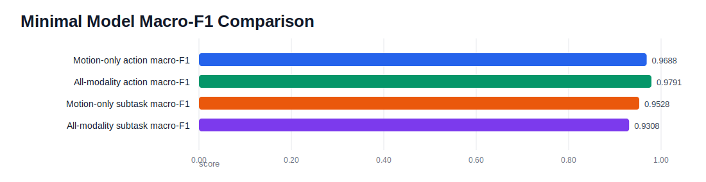
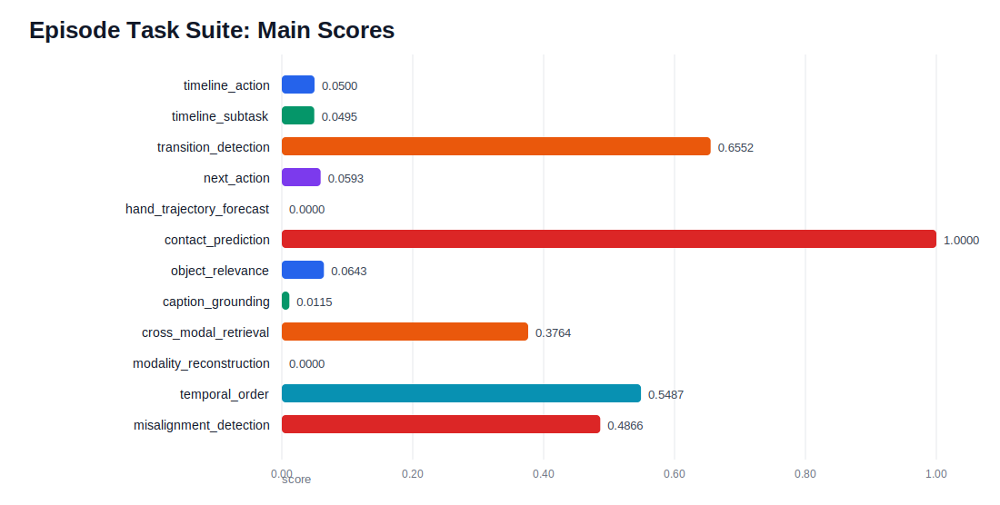
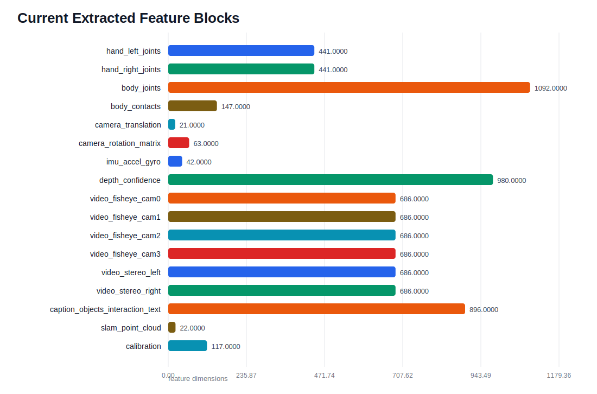

# Ropedia Episode Task Suite

Minimal, reproducible baselines for exploring one public Ropedia / Xperience-10M sample episode.

This repo turns a single multimodal embodied-AI episode into:

- all-modality window features,
- action/subtask classifiers,
- 12 single-episode task definitions,
- metrics, predictions, model artifacts, and visualizations.

> Scope: this is a learning and pipeline-validation repo. It does **not** claim cross-episode generalization because the public sample here is one episode.

## Dashboard

Open the static dashboard:

[docs/index.html](docs/index.html)

Pipeline overview:



Model comparison:



Episode task suite:



Feature blocks:



## What Is Included

```text
scripts/
  train_min_action_model.py         # motion/IMU baseline
  train_all_modalities_model.py     # all-modality lightweight baseline
  episode_task_suite.py             # 12 task suite
  generate_visualizations.py        # SVG + HTML dashboard generator

results/
  min_action_model/
  min_subtask_model/
  min_all_modalities_action_model/
  min_all_modalities_subtask_model/
  episode_task_suite/

notes/
  min_action_model.md
  all_modalities_model.md
  episode_task_suite.md

docs/
  index.html
  assets/
```

Raw Ropedia data is **not** committed. Download it from Hugging Face and follow the original dataset terms.

## Sample Data Expected

The scripts expect this workspace layout:

```text
<workspace>/
  HOMIE-toolkit/
  data/sample/xperience-10m-sample/
    annotation.hdf5
    fisheye_cam0.mp4
    fisheye_cam1.mp4
    fisheye_cam2.mp4
    fisheye_cam3.mp4
    stereo_left.mp4
    stereo_right.mp4
```

The public sample dataset is:

```text
ropedia-ai/xperience-10m-sample
```

## Setup

From a workspace folder:

```bash
git clone https://github.com/Ropedia/HOMIE-toolkit.git
python3.12 -m venv .venv
source .venv/bin/activate
pip install -r HOMIE-toolkit/requirements.txt huggingface_hub hf_xet
```

Download the sample:

```bash
hf download ropedia-ai/xperience-10m-sample \
  --repo-type dataset \
  --local-dir data/sample/xperience-10m-sample
```

Clone this repo into the same workspace or pass `--workspace` explicitly.

## Run

Motion-only baseline:

```bash
python scripts/train_min_action_model.py --workspace /path/to/workspace
```

All-modality baseline:

```bash
python scripts/train_all_modalities_model.py --workspace /path/to/workspace
```

Episode task suite:

```bash
python scripts/episode_task_suite.py --workspace /path/to/workspace
```

Generate dashboard:

```bash
python scripts/generate_visualizations.py
```

## Results Summary

All-modality action prediction:

```text
accuracy:          0.9828
balanced_accuracy: 0.9801
macro_f1:          0.9791
weighted_f1:       0.9828
feature_dim:       8378
classes:           18
```

All-modality subtask prediction:

```text
accuracy:          0.9828
balanced_accuracy: 0.9505
macro_f1:          0.9308
weighted_f1:       0.9838
feature_dim:       8378
classes:           14
```

Episode task suite key result:

```text
cross_modal_retrieval:
  top1: 0.1494
  top5: 0.3764
  top10: 0.4741
  MRR:  0.2634
```

This is the strongest single-episode signal: motion/IMU/camera features can retrieve matching depth/video windows better than random.

## Why Some Scores Are Low

The suite uses a chronological split:

```text
first 70% of the episode -> train
last 30% of the episode  -> test
```

The test segment contains actions/subtasks not present in the training segment, so timeline and next-action classifiers cannot predict labels they never saw. This is intentional: it exposes the limitation of one-episode learning.

## Interpretation

This repo demonstrates the full pipeline:

```text
raw multimodal sample
-> aligned windows
-> handcrafted all-modality features
-> supervised/self-supervised tasks
-> metrics and visualizations
```

For serious embodied-AI evaluation, use many episodes and split by held-out episode or held-out task instance.

## Data Notice

Ropedia / Xperience-10M data belongs to its original authors and is subject to the dataset's original license and access terms. This repo contains code and derived experiment artifacts only; it does not redistribute the raw dataset.
